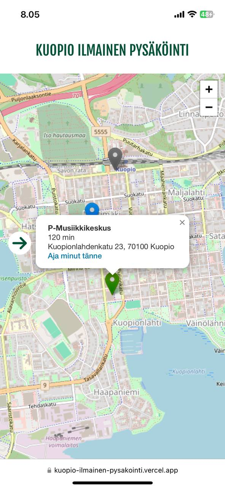
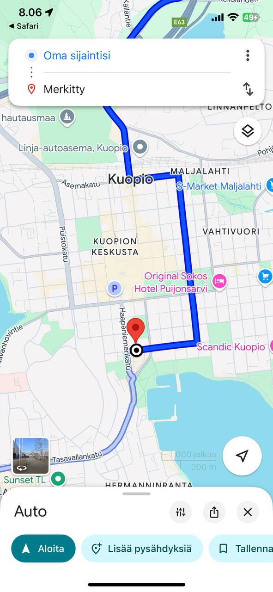
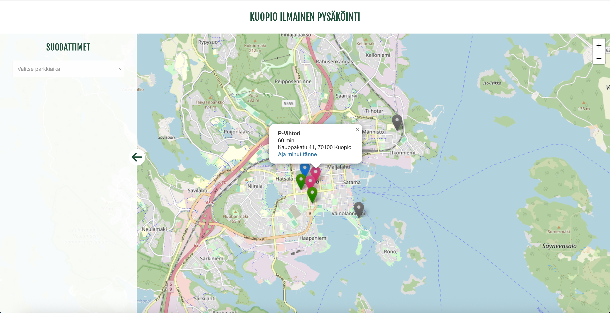

# Kuopio Free Parking Map

*This is an ongoing project! Check the progress live in Vercel:*
[https://kuopio-ilmainen-pysakointi.vercel.app/](https://kuopio-ilmainen-pysakointi.vercel.app/)

## About
Kuopio Free Parking Map is a React project built with Vite, featuring a Leaflet map that displays free parking spots in Kuopio. Parking locations are stored as GeoJSON. The plan is to integrate a MongoDB connection, allowing dynamic updates to the GeoJSON data. The user can filter the results on the map and use the Google Maps link "Aja minut tänne" to get directions to the parking spot from their current location.

## Tech Stack
- React
- Leaflet
- GeoJSON
- MongoDB (planned)

## Current version looks like this:

### Mobile view:

    
    

